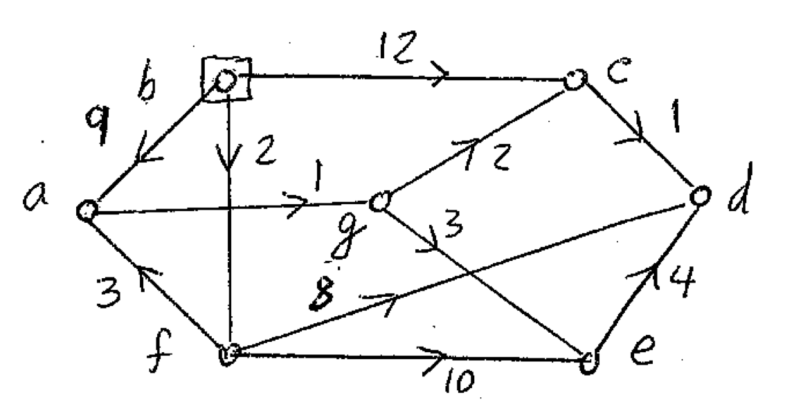

# Assignment 5
> # Dijkstra's Algorithm

In this assignment you will program Dijkstra's Algorithm using a custom graph class.


This image is the example used for the test cases.

## Objectives

TODO #1: Implement the incidentEdges function in ExtendedGraph.java

TODO #2: Implement the initializeSingleSource function in Path.java

TODO #3: Implement the dijkstra function in Path.java

This assignment will test your grasp on Dijkstra's algorithm.  
The steps are found within each function and it is your job to code it out.  

## Testing

* Testing can be done through Maven with the command, <br>
  `mvn test` <br>
* To run more specific tests, run the command <br>
  `mvn -Dtest=AssignmentTest#TESTCASEHERE test` <br>
  where `TESTCASEHERE` is the test case you want to run. These test cases can be found in **src/test/java/AssignmentTest** <br>
    * Ex:  `mvn -Dtest=AssignmentTest#testIncidentEdges test`

The results can be found in the command line or in **target/surefire-reports/AssignmentTest.txt** after execution.

**Part of grading will be these test cases.**

Alternatively,

You can use the main method found in Path.java. In fact, the test cases are dervied from that main method.

## Hints  

Below you will find the pseudo-code.
```
Initialize-single-source(G, s):  
  for each vertex of all vertices in G:
    v.d = infinity
    v.pi = NIL
  s.d = 0
  
RELAX(u,v,w):
  if u.d+w(u,v) < v.d:
    v.d = u.d + w(u,v)
    v.pi = u

Dijkstra(G,w,s):
  Initialize-single-source(G, s)
  Q = null set(O/) (priority queue)
  for each vertex U in G:		
    Enqueue(Q, U)
  while Q is not empty:		
    u = extract minimum(Q)	
    for each vertex v adjacent to u:	
      RELAX(u,v,w)
    update values of each vertex in priority queue
```


